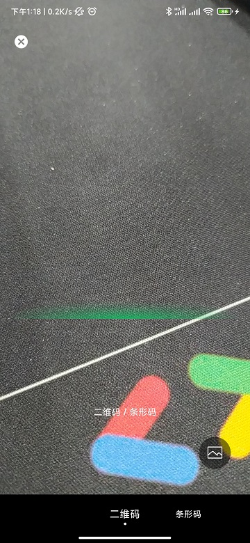
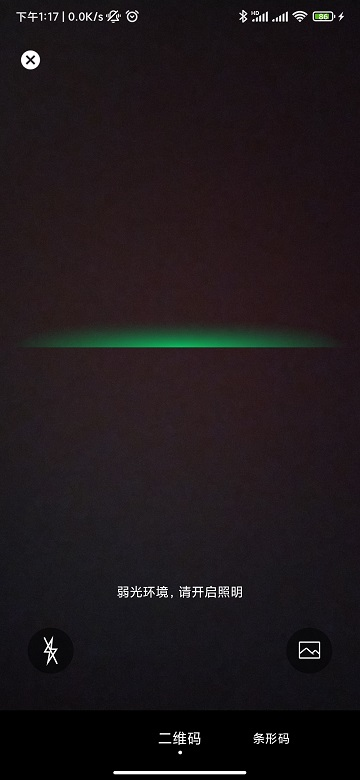
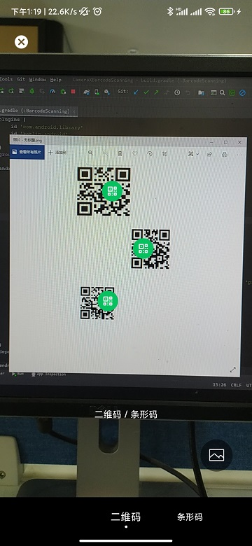
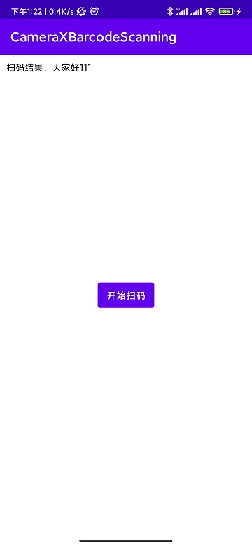

# BarcodeScanning


## 1.0.0

高仿微信扫一扫，Android端极速二维码/条形码识别。
使用CameraX + MLKit机器学习套件实现。

 - [x]  支持一屏多码识别
 - [x]  支持双击及手势缩放
 - [x]  支持弱光环境监测提示开启闪光灯
 - [x]  支持相册扫码
 - [x]  CameraX自带生命周期管理
 - [x]  Android5.0及以上


#  效果




# 使用前申请相关权限
```
Manifest.permission.CAMERA,
Manifest.permission.READ_EXTERNAL_STORAGE,
Manifest.permission.WRITE_EXTERNAL_STORAGE
```
# 扫一扫
```

    /**
     * 开始扫描
     */
    private fun startScann() {
        ScanningManager.instance.openScanningActivity(
            this,
            Config(
                true,
                ScanType.QR_CODE,
                object : AlbumOnClickListener {
                    override fun onClick(v: View, callBack: CallBackFileUri) {
                        // 1、检查申请必要的权限

                        // 2、相册选完图片，回调uri进行识别
                        pictureSelector(callBack)
                    }
                },
                object : ScanResultListener {
                    override fun onSuccessListener(value: String?) {
                        resultView.text = "扫码结果： \n$value"
                    }

                    override fun onFailureListener(error: String) {
                    }

                    override fun onCompleteListener(value: String?) {
                    }
                })
        )
    }


 # Config 参数说明

Config(
    /**
     * 是否开启多码识别
     * 不开启时，取最大范围的
     */
    val enabled: Boolean = true,
    /**
     * 默认扫码类型
     * 二维码 / 条形码
     */
    @ScanType
    val scanType: Int = ScanType.QR_CODE,

    /**
     * 相册点击回调
     */
    var albumOnClickListener: AlbumOnClickListener? = null,
    /**
     * 扫码回调
     */
    val scanResultListener: ScanResultListener? = null
)
```
